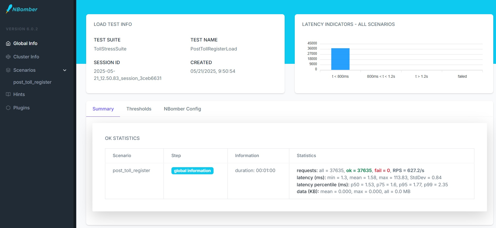

# Resultados do Teste de Stress

# Introdução  

Bem-vindo ao teste técnico da Thunders! 🚀 

Estamos empolgados por você estar participando deste desafio e animados para conhecer melhor suas habilidades e seu potencial. Aproveite este momento para demonstrar sua criatividade, conhecimento técnico e capacidade de resolver problemas. 

Lembre-se: você não está sozinho nessa jornada! Caso tenha qualquer dúvida ou precise de suporte, sinta-se à vontade para entrar em contato com o nosso time. Estamos aqui para ajudar e garantir que você tenha a melhor experiência possível. 

Boa sorte e mãos à obra! Estamos ansiosos para ver o que você pode criar. 

# Requisitos Funcionais 

O governo anunciou a abertura de uma licitação para o desenvolvimento e implementação de um sistema informatizado voltado à geração de relatórios detalhados de faturamento das unidades de pedágio do país. Como vencedor dessa licitação, você será responsável por projetar e implementar uma solução eficiente e escalável, 
capaz de receber dados sobre as utilizações de cada unidade e consolidá-los em um relatório no formato especificado pelo edital. De acordo com informações do UOL, o Brasil conta com mais de 1.800 praças de pedágio distribuídas pelas 27 unidades federativas, o que evidencia a magnitude e a importância do projeto. Este software deverá não apenas atender aos requisitos técnicos, 
mas também ser capaz de lidar como grande volume de dados gerado diariamente, garantindo a precisão e a agilidade necessárias para a tomada de decisões administrativas e estratégicas. 

Os dados de utilização devem ser unitários e conter minimamente os atributos a seguir: 

- Data e hora de utilização 
- Praça 
- Cidade 
- Estado 
- Valor pago 
- Tipo de veículo (Moto, Carro ou Caminhão) 

 

Os relatórios a seguir foram solicitados: 

- Valor total por hora por cidade 
- As praças que mais faturaram por mês (a quantidade a ser processada deve ser configurável) 
- Quantos tipos de veículos passaram em uma determinada praça 

# Requisitos Técnicos 

 
A solução deve utilizar o template já estruturado disponível neste repositório, basta criar um fork ou clonar para começar.

- Toda implementação deve ser feita dentro do projeto ApiService encontrado no template. Recomenda-se não alterar o código dos outros projetos, porém, caso julgue necessário, alterações podem ser realizadas. 
- A solução deverá fornecer uma API para que as empresas dos pedágios possam enviar os dados.  
- O gatilho para processamento dos relatórios deve ser via API, simulando um agendamento. 
- Persistir os dados de utilização e os resultados dos relatórios. 
- O Timeout padrão é de 10 segundos e não pode ser alterado. 
- A solução utiliza .NET Aspire, então serviços externos como RabbitMQ, SQL Server e outros estão disponíveis de antemão. Para iniciar a aplicação basta manter o projeto AppHost como startup project. 
- Para facilitar o uso do broker a biblioteca Rebus está disponível, bastando apenas a criação de mensagens e seus respectivos “ouvintes”. 
- A implementação de testes para demonstrar o potencial da solução garantirá pontos extras. 
- A solução fornece suporte para OpenTelemetry 
- Considerar que milhões de registros serão ingeridos pela aplicação. 
- Os componentes existentes podem ser alterados, por exemplo SQL Server -> Postgres ou RabbitMQ -> Kafka. 
- Novos componentes podem ser agregados a solução, caso seja necessário.

 

Alguns componentes foram criados e disponibilizados para facilitar a implementação do teste: 

- Interface ‘IMessageSender’ do projeto OutOfBox: permite o envio de mensagens para o broker. 
- Features: para habilitar o uso de Mensageria ou Entity Framework através do padrão de configurações do .NET 